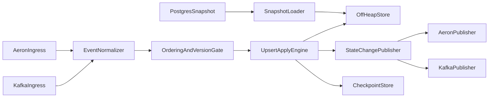

# Local Off-Heap Store Generator Architecture

## Problem

Build a single-node Java service that restores entities from a PostgreSQL snapshot, consumes versioned upsert events from Aeron and Kafka, applies ordered updates to an off-heap view, and publishes deterministic state-change notifications.

## High-Level Components

1. Snapshot Loader
   - Reads persisted entity state and snapshot watermark/checkpoint.
   - Seeds the off-heap store before streaming starts.
2. Ingress Adapters
   - Aeron consumer and Kafka consumer emit a normalized internal event shape.
3. Ordering and Version Gate
   - Enforces per-entity version monotonicity and idempotency.
4. Apply Engine
   - Applies accepted upserts into off-heap materialized view.
5. Change Publisher
   - Emits normalized change notifications to Aeron and Kafka.
6. Checkpoint Store
   - Persists per-source replay positions and last applied metadata.

## Runtime Data Flow

## Key Design Decisions

- Single-threaded apply path for deterministic ordering inside one process.
- Per-entity version gate prevents stale rewrites.
- Off-heap value storage to reduce GC pressure and increase memory density.
- Internal normalized event contract decouples transport adapters from domain logic.
- Replay starts at stored checkpoint/watermark after snapshot bootstrap.

## Non-Goals (Phase 1)

- Multi-node clustering/sharding.
- Exactly-once semantics across both Aeron and Kafka simultaneously.
- Fully automated failover/orchestration.

## Phase Exit Criteria

- M1: architecture approved.
- M2: modules compile and tests execute.
- M3: deterministic restore + replay behavior validated.
- M4: notifications published to both transports with retry handling.
- M5: reliability/performance baseline documented.
